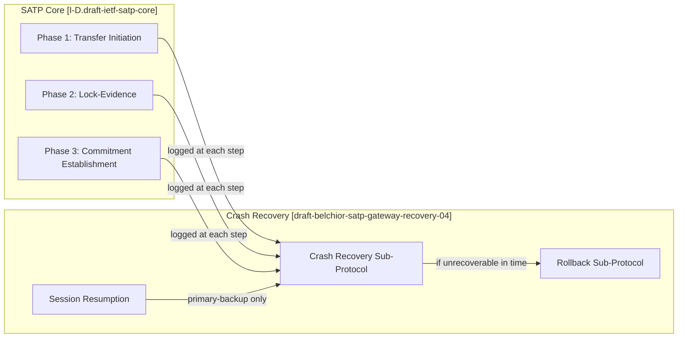
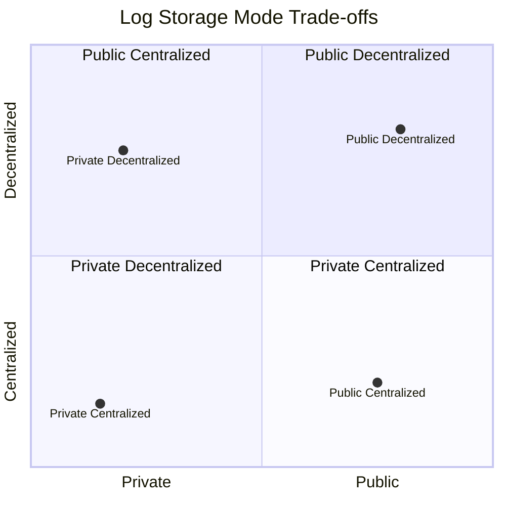
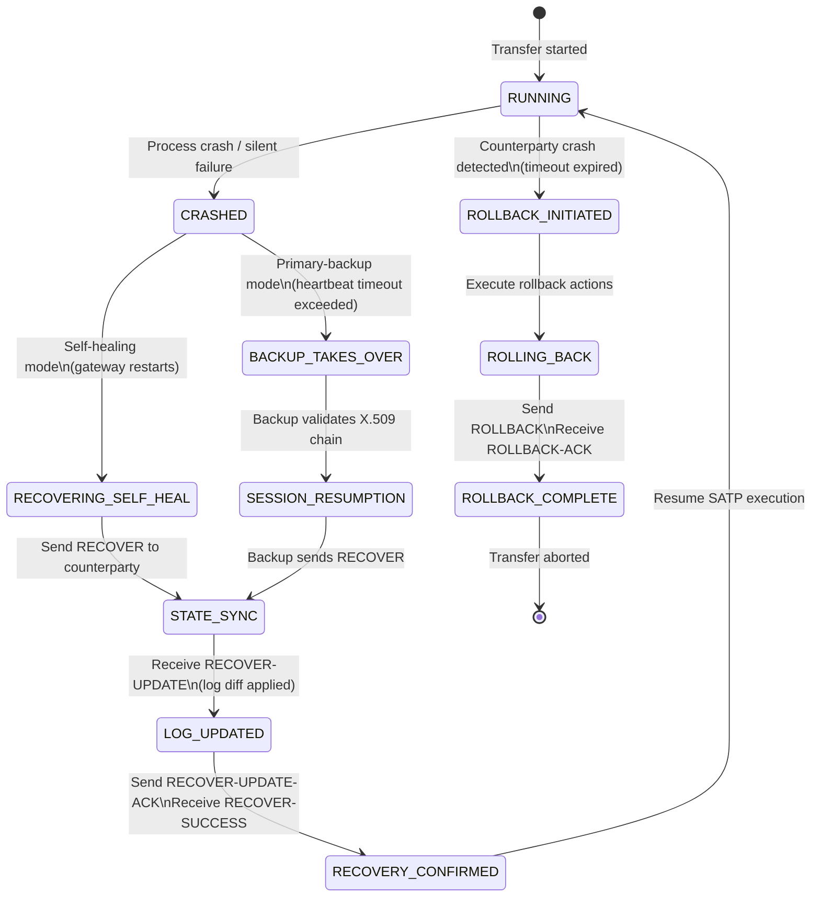
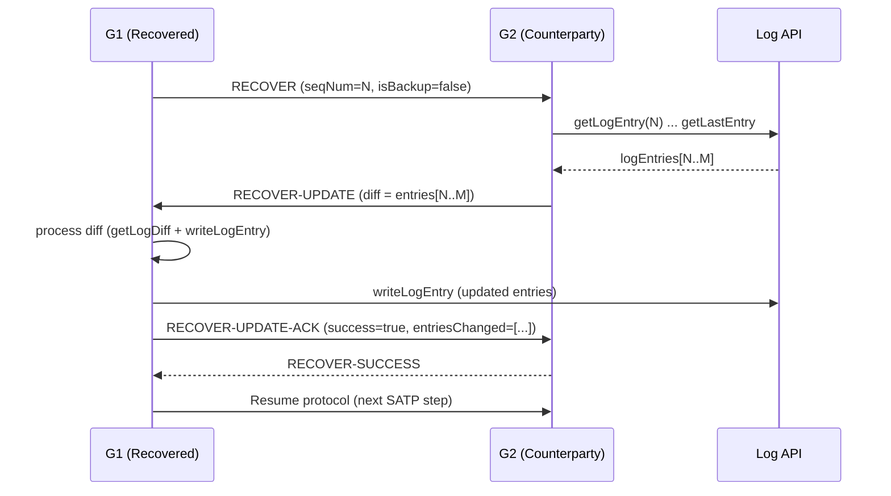
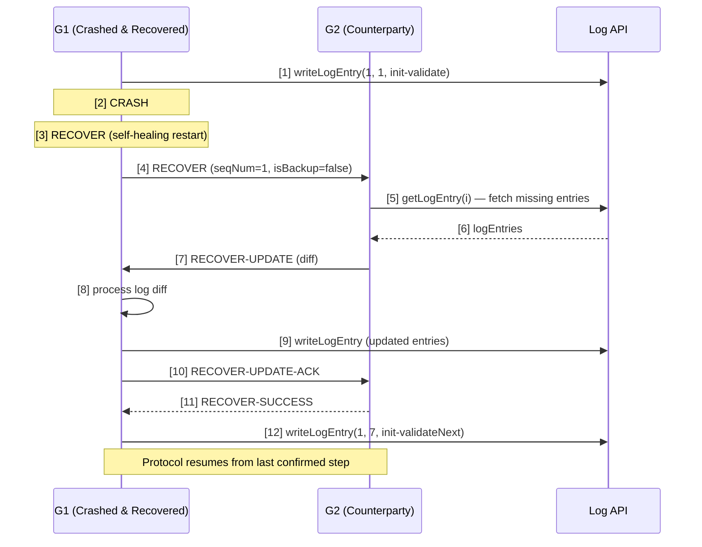
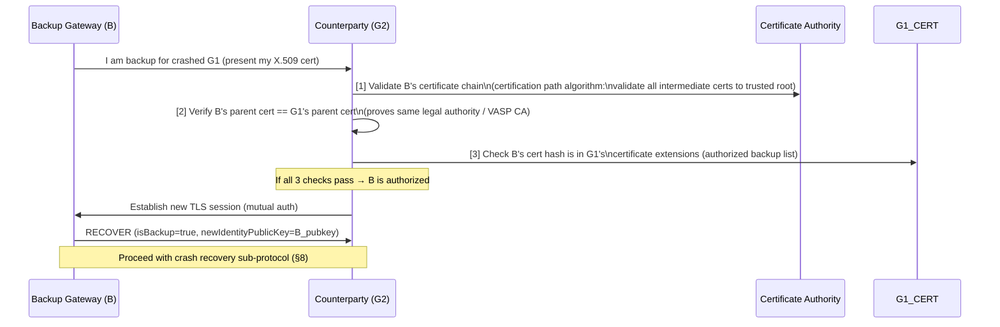
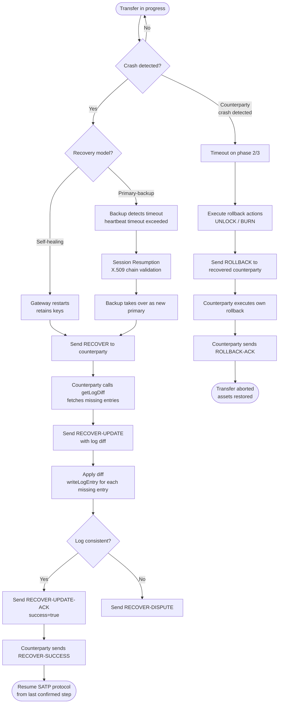

# IETF SATP Gateway Crash Recovery — Knowledge Base

> Source: [`draft-belchior-satp-gateway-recovery-04`](https://www.ietf.org/archive/id/draft-belchior-satp-gateway-recovery-04.txt)  
> Editor's copy: [`ietf-satp.github.io`](https://ietf-satp.github.io/draft-belchior-satp-gateway-recovery/draft-belchior-satp-gateway-recovery.html)  
> Source & issues: [`github.com/ietf-satp/draft-belchior-satp-gateway-recovery`](https://github.com/ietf-satp/draft-belchior-satp-gateway-recovery)  
> Authors: R. Belchior, M. Correia, A. Augusto (INESC-ID / Técnico Lisboa), T. Hardjono (MIT)  
> Status: Informational Internet-Draft (individual, not yet WG-adopted) — Expires 31 July 2026  
> Related: [`draft-ietf-satp-core`](https://datatracker.ietf.org/doc/draft-ietf-satp-core/) (WG document, submitted to IESG)

---

## Table of Contents

1. [Overview](#1-overview)
2. [Terminology](#2-terminology)
3. [Logging Model](#3-logging-model)
4. [Log Entry Format](#4-log-entry-format)
5. [Log Storage Modes](#5-log-storage-modes)
6. [Log Storage API](#6-log-storage-api)
7. [Two Recovery Models](#7-two-recovery-models)
8. [Recovery Messages](#8-recovery-messages)
9. [Recovery Procedure per SATP Phase](#9-recovery-procedure-per-satp-phase)
10. [Recovery Scenarios — Sequence Flows](#10-recovery-scenarios--sequence-flows)
11. [Session Resumption — Primary-Backup Mode](#11-session-resumption--primary-backup-mode)
12. [Security Considerations](#12-security-considerations)
13. [Performance Considerations](#13-performance-considerations)
14. [Assumptions](#14-assumptions)
15. [Message Fields Reference](#15-message-fields-reference)
16. [SATP WG Context and Status](#16-satp-wg-context-and-status)

---

## 1. Overview

SATP Gateway Crash Recovery ensures that asset transfers across ledgers maintain **ACID properties** even when gateways crash. The mechanism:

- Defines a **logging model** where gateways write log entries before and after each protocol step.
- Defines two recovery models: **self-healing** (same gateway recovers) and **primary-backup** (backup gateway takes over).
- Specifies a **crash recovery sub-protocol** (5 messages: RECOVER, RECOVER-UPDATE, RECOVER-SUCCESS, ROLLBACK, ROLLBACK-ACK).
- Specifies a **session resumption protocol** for primary-backup mode (X.509 certificate validation chain).

### Relationship to SATP Core

The crash recovery draft is **protocol-agnostic** with respect to SATP phase content — it defines procedures that apply independently of _which_ SATP phase was executing at crash time. The crash recovery draft wraps SATP phases 1–3 (Transfer Initiation, Lock-Evidence, Commitment Establishment).



---

## 2. Terminology

| Term | Definition |
|---|---|
| **Gateway** | Service connecting to ≥ 1 network, implements SATP. |
| **Origin Gateway (G1)** | Initiates the transfer; acts as ACP Coordinator. |
| **Destination Gateway (G2)** | Target of transfer; acts as ACP Participant. |
| **Primary Gateway** | Currently active gateway for a transfer. |
| **Backup Gateway** | Standby gateway with copy of G1's state; takes over on primary crash. |
| **Log** | Ordered stack of log entries (newest = top). |
| **Log entry** | Single protocol-step record written to the log. |
| **Log data** | Information retained by a gateway for one message flow step. |
| **ACP** | Atomic Commit Protocol (2PC or 3PC). Ensures assets taken from one network are persisted to another. |
| **Crash fault** | A gateway becoming silent (not Byzantine / malicious). |
| **Self-healing** | Gateway eventually recovers; retains long-term keys. |
| **Primary-backup** | Primary may never recover; backup detected by heartbeat timeout. |
| **Rollback list** | Per-gateway list of transactions that can be reverted. |

---

## 3. Logging Model

### 3.1 Log as a Stack

The log is a **stack of log entries**, newest at the top (highest index). For every protocol step a gateway performs:

1. Write a **pre-execution** log entry (`init-*` operation) **before** the step.
2. Execute the step.
3. Write a **post-execution** log entry (`done-*` operation) **after** the step.
4. Write an **acknowledgment** entry (`ack-*`) when counterparty confirms.

### 3.2 Log Primitives

| Primitive | Direction | Description |
|---|---|---|
| `writeLogEntry(e, L)` | WRITE | Append entry `e` to log `L`. |
| `getLogEntry(i, L)` | READ | Retrieve entry at index `i` from log `L`. |
| `getLogLength(L)` | READ | Count entries in log `L`. |
| `getLogDiff(l1, l2)` | READ | Return entries in `l2` not in `l1` (missing entries). |
| `getLastEntry(L)` | READ | Get the most recent entry. |
| `getLog(L)` | READ | Retrieve entire log. |
| `updateLog(l1, l2)` | WRITE | Bring `l1` up to date using diff of `l2`. |

### 3.3 Operation Types per Log Entry

| Operation prefix | Meaning |
|---|---|
| `init-*` | Gateway intends to execute this step (pre-execution). |
| `exec-*` | Gateway is executing this step (in-progress). |
| `done-*` | Gateway successfully completed this step (post-execution). |
| `ack-*` | Gateway acknowledges counterparty's done message. |
| `fail-*` | Gateway failed to execute this step. |

### 3.4 SATP Example: Lock-Assertion (Phase 2.2)

```
             G1                           G2                    Log API
             |                             |                       |
             |----(1) writeLogEntry(2, 2.2-1, init-lock-assertion)-->|
             |   Lock-Assertion (phase 2.2)|                       |
             |--------------------------->|                        |
             |                            |-(4) writeLogEntry(2, 2.2-2, exec-lock-assertion)->|
             |                            |-- execute lock ---|    |
             |                            |-(6) writeLogEntry(2, 2.2-3, done-lock-assertion)->|
             |                            |-(7) generate receipt--|  |
             |                            |-(9) writeLogEntry(2, 2.2-4, ack-lock-assertion)->|
             |<--(10) lock assertion receipt--|                   |
```

---

## 4. Log Entry Format

Log entries are JSON-formatted. The following fields are **mandatory** in every SATP log entry:

### 4.1 SATP Schema Fields (inherited from SATP core)

| Field | Type | Description |
|---|---|---|
| `version` | string | SATP protocol version (major.minor) |
| `sessionId` | UUID v2 | Unique session identifier |
| `contextId` | UUID v2 | Session context ID `[I-D.draft-avrilionis-satp-setup-stage-01]` |
| `seqNumber` | integer | Monotonically increasing counter per message |
| `satpPhase` | string | Current SATP phase (e.g., `"lock"`, `"commit"`) |
| `resourceURL` | string | Location of resource being accessed |
| `developerURN` | string | Developer/application identity assertion |
| `actionResponse` | string | `GET`/`POST` method + arguments, or response code |
| `credentialProfile` | string | Auth type: `SAML`, `OAuth`, `X.509` |
| `credentialBlock` | string | Credential token/certificate |
| `payloadProfile` | string | Asset provenance and capabilities profile |
| `applicationProfile` | string | Vendor/application-specific profile |
| `payload` | object | Phase-specific payload |
| `payloadHash` | string | Hash of current message payload |

### 4.2 Crash Recovery Required Fields

| Field | Required | Description |
|---|---|---|
| `timestamp` | REQUIRED | UNIX timestamp of log entry creation |
| `originGatewayPubkey` | REQUIRED | Public key of origin gateway |
| `originGatewaySystem` | REQUIRED | ID of the source network |
| `destinationGatewayPubkey` | REQUIRED | Public key of destination gateway |
| `destinationGatewaySystem` | REQUIRED | ID of destination network |
| `loggingProfile` | REQUIRED | Log storage profile (default: `"Local Store"`) |
| `messageSignature` | REQUIRED | ECDSA signature of gateway over the log entry |
| `lastEntryHash` | REQUIRED | Hash of the previous log entry (chain) |
| `accessControlProfile` | REQUIRED | Confidentiality profile (default: `"GatewayOnly"`) |
| `operation` | REQUIRED | One of: `init-*`, `exec-*`, `done-*`, `ack-*`, `fail-*` |

### 4.3 Optional Fields

| Field | Description |
|---|---|
| `recoveryMessage` | Recovery message type if in recovery procedure |
| `recoveryPayload` | Payload associated with recovery message |

### 4.4 Example Log Entry (G2 acknowledging G1 locking an asset)

> **Note on field naming**: The draft Section 4 defines this field as "SATP Phase" in prose but uses `phaseId` as the JSON key in Figure 6. This knowledge base normalizes it to `satpPhase` for consistency with the field description. Implementations should handle both.

```json
{
  "sessionId":   "4eb424c8-aead-4e9e-a321-a160ac3909ac",
  "contextId":   "5eb424c8-aead-4e9e-a321-a160ac3909ac",
  "seqNumber":   7,
  "satpPhase":   "lock",
  "originGatewayId":      "5.47.165.186",
  "originNetworkId":      "Hyperledger-Fabric-JusticeChain",
  "destinationGatewayId": "192.47.113.116",
  "destinationNetworkId": "Ethereum",
  "timestamp":   "1606157333",
  "payload": {
    "messageType": "2pc-log",
    "message":     "LOCK_ASSET_ACK",
    "votes":       "none"
  }
}
```

---

## 5. Log Storage Modes

The log storage mode determines trust assumptions, data availability, and recovery procedure complexity.



| Mode | Storage | Access | Integrity | Availability | Privacy | Recommended for |
|---|---|---|---|---|---|---|
| **Public Decentralized** | Blockchain / IPFS | Anyone | Hash on chain | Very high | Low (public) | Relay Mode (different orgs) |
| **Public Centralized** | Multi-org bulletin | Multiple orgs | Redundancy | Medium | Medium | Multi-org consortium |
| **Private Centralized** | Local / cloud | Gateway self | Weakest | Local | High | Single-org, speed-critical |
| **Private Decentralized** | Private blockchain | Gateway consortium | Chain hash | High | High | Trusted consortium |

**Default**: If gateways belong to **different institutions**, use **decentralized log storage** as a common source of truth to solve disputes.

### Recovery procedure per mode

- **Private Centralized**: Crashed gateway requests missing entries from counterparty's log.
- **Public Decentralized**: Crashed gateway fetches missing entries from the shared ledger directly.
- **Public Centralized / Private Decentralized**: Hybrid — query shared store for hash, request entries from counterparty if needed.

---

## 6. Log Storage API

The Log Storage API abstracts over different storage backends (relational, non-relational, local, on-chain).

| Endpoint | Method | Parameters | Returns |
|---|---|---|---|
| `POST /writeLogEntry/:logId` | WRITE | `logId`: entry to append | Entry index (string) |
| `GET /getLogEntry/:id` | READ | `id`: entry id | Log entry (JSON) |
| `GET /getLogLength` | READ | none | Length (string) |
| `POST /getLogDiff/:log` | READ | `log`: log to compare | Diff (JSON) |
| `GET /getLastEntry` | READ | none | Latest log entry (JSON) |
| `GET /getLog` | READ | none | Full log (JSON) |

All responses:
```json
{ "success": true, "response_data": "<payload>" }
```

Error responses: HTTP 5XX with `success: false`.

---

## 7. Two Recovery Models

### 7.1 State Machine



### 7.2 Self-Healing Model

**Assumption**: After a crash, the gateway **eventually recovers** and:
- Retains its long-term key pair.
- Can re-establish all TLS connections.

**Recovery steps**: Crash communication → State update → Recovery communication → Resume.

### 7.3 Primary-Backup Model

**Assumption**: Primary gateway may **never recover**. Backup gateway is detected by:
- Heartbeat messages between primary and backup.
- Conservative timeout period (Alsberg & Day, "A principle for resilient sharing of distributed resources", 1976).

When timeout is exceeded, the backup detects the failure **unequivocally** and initiates session resumption (§11) before the crash recovery sub-protocol.

---

## 8. Recovery Messages

All recovery messages follow the log entry format (§4) with message-specific fields in the `payload`.

### 8.1 RECOVER

Sent by: crashed/recovered gateway → counterparty gateway.

Purpose: Informs the counterparty of the crash and provides the recovering gateway's most recent known state.

**Message Type**: `urn:ietf:SATP-2pc:msgtype:recover-msg`

| Field | Required | Description |
|---|---|---|
| `sessionId` | ✓ | Session identifier |
| `contextId` | ✓ | Session context identifier |
| `messageType` | ✓ | `urn:ietf:SATP-2pc:msgtype:recover-msg` |
| `satpPhase` | ✓ | Latest SATP phase registered in log |
| `seqNumber` | ✓ | Latest sequence number in log |
| `isBackup` | ✓ | `true` if sender is a backup gateway |
| `newIdentityPublicKey` | optional | Backup gateway's public key (if `isBackup = true`) |
| `lastEntryTimestamp` | ✓ | Timestamp of last known log entry |
| `senderSignature` | ✓ | ECDSA digital signature of sender |

### 8.2 RECOVER-UPDATE

> **Draft erratum**: Section 5.3.2 of the draft titles this message "RECOVER-UDPDATE" (transposed letters). The correct name is RECOVER-UPDATE as used in the message type URN and throughout this knowledge base.

Sent by: counterparty gateway → recovering gateway.

Purpose: Provides the log diff (missing entries) needed for the recovering gateway to catch up.

**Message Type**: `urn:ietf:SATP-2pc:msgtype:recover-update-msg`

| Field | Required | Description |
|---|---|---|
| `sessionId` | ✓ | Session identifier |
| `contextId` | ✓ | Session context identifier |
| `messageType` | ✓ | `urn:ietf:SATP-2pc:msgtype:recover-update-msg` |
| `hashRecoverMessage` | ✓ | Hash of the received RECOVER message |
| `recoveredLogs` | ✓ | List of log entries the recovered gateway needs |
| `senderSignature` | ✓ | ECDSA digital signature of sender |

### 8.3 RECOVER-SUCCESS

Sent by: recovering gateway → counterparty gateway.

Purpose: Confirms log synchronization successful. If inconsistencies detected, send RECOVER-DISPUTE instead.

> **RECOVER-DISPUTE**: Mentioned in draft Section 5.3.3 but not fully specified. A RECOVER-DISPUTE message would be sent when the recovered gateway detects inconsistencies in the log entries received via RECOVER-UPDATE (e.g., hash mismatch, missing entries, tampered payloads). The resolution mechanism for disputes is left to future work.

**Message Type**: `urn:ietf:SATP-2pc:msgtype:recover-update-ack-msg`

| Field | Required | Description |
|---|---|---|
| `sessionId` | ✓ | Session identifier |
| `contextId` | ✓ | Session context identifier |
| `messageType` | ✓ | `urn:ietf:SATP-2pc:msgtype:recover-update-ack-msg` |
| `hashRecoverUpdateMessage` | ✓ | Hash of the received RECOVER-UPDATE message |
| `success` | ✓ | `true` if logs consistent; `false` triggers RECOVER-DISPUTE |
| `entriesChanged` | ✓ | List of hashes of log entries appended |
| `senderSignature` | ✓ | ECDSA digital signature of sender |



### 8.4 ROLLBACK

Sent by: non-crashed gateway initiating rollback after counterparty timeout.

**Message Type**: `urn:ietf:SATP-2pc:msgtype:rollback-msg`

| Field | Required | Description |
|---|---|---|
| `sessionId` | ✓ | Session identifier |
| `contextId` | ✓ | Session context identifier |
| `messageType` | ✓ | `urn:ietf:SATP-2pc:msgtype:rollback-msg` |
| `success` | ✓ | Whether rollback was performed |
| `actionsPerformed` | ✓ | Actions taken (e.g., `UNLOCK`, `BURN`) |
| `proofs` | ✓ | Network-specific proofs of rollback |
| `senderSignature` | ✓ | ECDSA digital signature |

### 8.5 ROLLBACK-ACK

Sent by: recovering gateway → gateway that sent ROLLBACK.

Acknowledges that the rollback was received and confirms own rollback actions.

**Message Type**: `urn:ietf:SATP-2pc:msgtype:rollback-ack-msg`

| Field | Required | Description |
|---|---|---|
| `sessionId` | ✓ | Session identifier |
| `contextId` | ✓ | Session context identifier |
| `messageType` | ✓ | `urn:ietf:SATP-2pc:msgtype:rollback-ack-msg` |
| `success` | ✓ | Whether rollback was acknowledged |
| `actionsPerformed` | ✓ | Rollback actions performed |
| `proofs` | ✓ | Network-specific proofs |
| `senderSignature` | ✓ | ECDSA digital signature |

---

## 9. Recovery Procedure per SATP Phase

### Phase 1: Transfer Initiation Flow

Follows the general crash recovery model. No ledger changes have occurred yet, so recovery is straightforward — re-establish state and resume.

### Phase 2: Lock-Evidence Flow

Follows the general model. **Critical constraint**: Crash recovery must complete within the asset transfer's lock timeout. If recovery takes too long, the **rollback protocol** is triggered.

> Distributed ledger changes have occurred (lock). Recovery must happen before the lock expires.

### Phase 3: Commitment Establishment Flow

Most complex phase. Transactions on blockchains cannot be directly undone — rollback requires **issuing new inverse transactions**.

**Rollback list** per gateway tracks which transactions can be inverted:

| SATP Step | Origin Gateway Action | Destination Gateway Action |
|---|---|---|
| 2.1A — pre-lock | Add `pre-lock` tx to origin rollback list | — |
| 2.1B — denied | Abort + apply origin rollback | — |
| 3.4A — lock | Add `lock` tx to origin rollback list | — |
| 3.4B — commit fails | Abort + apply origin rollback | — |
| 3.6A — mint/create | — | Add `create-asset` tx to destination rollback list |
| 3.8 — success | SATP terminates (3.9) | SATP terminates |
| 3.8 — last commit fails | Abort + apply **both** rollback lists | Abort + apply **both** rollback lists |

---

## 10. Recovery Scenarios — Sequence Flows

### 10.1 Scenario A: Crash Before Issuing Command to Counterparty

G1 crashes after writing `init-validate` to the log but before sending the command to G2.



**Key**: G1 never sent the command to G2. G2's log may be ahead of G1's. G1 requests the diff and catches up.

### 10.2 Scenario B: Crash After Issuing Command to Counterparty

G1 crashes after sending `Lock-Assertion` to G2, but before receiving the receipt.

```mermaid
sequenceDiagram
  participant G1 as G1 (Crashed & Recovered)
  participant G2 as G2 (Counterparty)
  participant LOG as Log API

  G1 ->> LOG: [1] writeLogEntry(2, 1, init-validate)
  G1 ->> G2: [2] Lock-Assertion message
  Note over G1: [3] CRASH

  G2 ->> LOG: [4] writeLogEntry(exec-validate)
  G2 ->> G2: [5] execute validate
  G2 ->> LOG: [6] writeLogEntry(done-validate)
  G2 ->> LOG: [7] writeLogEntry(ack-validate)
  G2 ->> G1: [8] Lock-Assertion-Receipt (discovers G1 crashed via timeout)

  Note over G1: [9] RECOVER
  G1 ->> G2: [10] RECOVER (seqNum=1)
  G2 ->> LOG: [11] getLogEntry(i)
  LOG -->> G2: [12] logEntries
  G2 ->> G1: [13] RECOVER-UPDATE (diff = steps 4-7)

  G1 ->> G1: [14] process log diff
  G1 ->> LOG: [15] writeLogEntry (updated)
  G1 ->> G2: [16] RECOVER-UPDATE-ACK
  G2 -->> G1: [17] RECOVER-SUCCESS

  G1 ->> LOG: [18] writeLogEntry(1, 7, init-validateNext)
  Note over G1,G2: G1 knows G2 completed; protocol resumes
```

**Key**: G1 crashed after sending but before receiving confirmation. G2 completed steps 4–7 in G1's absence. The RECOVER mechanism brings G1's log up to the same state as G2's so transfer can continue.

### 10.3 Scenario C: Rollback After Counterparty Crash (G2 rollback)

G1 sends `COMMIT-PREPARE` to G2. G2 crashes. G1 detects via timeout.

```mermaid
sequenceDiagram
  participant G1 as G1 (Initiates Rollback)
  participant G2 as G2 (Crashed)
  participant LOG as Log API

  G1 ->> G2: [1] COMMIT-PREPARE (Phase 3)
  Note over G2: [2] CRASH

  G2 -->> G1: [3] COMMIT-PREPARE-ACK (timeout — G1 discovers G2 crashed)

  Note over G1: [4] Timeout detected
  G2 ->> LOG: [5] writeLogEntry(exec-rollback)
  G2 ->> G2: [6] execute rollback
  G2 ->> LOG: [7] writeLogEntry(done-rollback)
  G2 ->> LOG: [8] writeLogEntry(ack-rollback)

  Note over G1: [9] RECOVER (G1 also self-heals)
  G1 ->> G2: [10] RECOVER (seqNum=N)
  G2 ->> LOG: [11] getLogEntry(i)
  LOG -->> G2: [12] logEntries
  G2 ->> G1: [13] RECOVER-UPDATE (diff)

  G1 ->> G1: [14] process log diff
  G1 ->> LOG: [15] writeLogEntry (updated)
  G1 ->> G2: [16] RECOVER-UPDATE-ACK
  G2 -->> G1: [17] RECOVER-SUCCESS

  Note over G1: [18] G1 discovers G2 performed rollback from log

  G1 ->> G1: [19] execute own rollback
  G1 ->> G2: [20] ROLLBACK-ACK
  Note over G1,G2: Transfer aborted; assets restored
```

**Key**: G2's log reveals it performed a rollback. G1 must also rollback to restore consistency. G1 → G2's `ROLLBACK-ACK` confirms both sides rolled back.

---

## 11. Session Resumption — Primary-Backup Mode

Before the backup gateway (B) can engage with the counterparty (G2), it must prove it is an authorized replacement for the crashed primary (G1).

> **Cross-reference**: SATP Core ([`draft-ietf-satp-core`](https://www.ietf.org/archive/id/draft-ietf-satp-core-12.txt)) Section 11 also discusses session resumption. The Core draft outlines the general mechanism where a backup gateway builds trust with the counterparty to resume execution, and defers the detailed recovery and resumption specification to this crash recovery draft. The Core draft notes that self-healing does not require protocol changes (the counterparty simply sees longer delays), while the primary-backup mode requires the session resumption process defined here.

### 11.1 X.509 Trust Chain Validation

**Assumptions**:
- Every gateway has a valid **X.509 certificate** issued by its owner (legally responsible entity).
- The certificate extensions field contains a **list of hashes of authorized backup gateways**.

### 11.2 Validation Steps



### 11.3 Backup's Own Backup Registration

The backup gateway B must itself designate backups for use if B crashes:
- B's X.509 certificate extensions field contains the hash list of B's authorized backups.

---

## 12. Security Considerations

| Assumption | Detail |
|---|---|
| **Authenticated channel** | TLS/HTTPS between gateways. Messages cannot be spoofed or altered. |
| **OAuth2.0 credentials** | Client credential schemes. |
| **Log confidentiality** | Storage service must provide AuthN/AuthZ (e.g., OAuth+OIDC), TLS in transit. |
| **Crash-fault tolerant** | Protocol handles silent crashes only. **Not Byzantine-fault tolerant** — gateways are trusted. |
| **Log integrity** | Each entry contains hash of payload. Optional: sign entries with creator's key (non-repudiation). |
| **Log availability** | Log Storage API connects to dependable storage. Mode-dependent availability guarantees. |
| **Log access control** | `accessControlProfile` per entry. ACLs can be used for simple authorization. |
| **Hardware hardening** | Intel SGX can additionally protect log storage API nodes. |
| **Performance** | Symmetric-key TLS sessions after initial asymmetric-key setup deliver low latency for log exchange. |

### Attack Surface

Log entries are attractive attack targets:
- Compromise log integrity → false state reconstruction → double-spend or incorrect rollback.
- Mitigation: hash chaining (`lastEntryHash`), ECDSA signatures on entries, decentralized storage for highest guarantees.

---

## 13. Performance Considerations

> Source: Draft Section 8

After session setup using asymmetric cryptography, the authenticated messages in the TLS Record Protocol use **symmetric-key operations** (session key). Since symmetric-key operations are much faster than public-key operations, a **persistent TLS connection** delivers performance suitable for quickly exchanging log entries across gateways.

Upon a crash, gateways employ their **best effort** for resuming the crashed session. The performance overhead of recovery is dominated by:

1. **Log synchronization**: Fetching and applying the log diff between the recovered gateway and its counterparty. For a public decentralized log, this involves reading from the shared ledger (latency depends on the ledger's throughput and confirmation time). For private centralized logs, this is a direct gateway-to-gateway exchange (lower latency, higher trust requirement).
2. **Session resumption** (primary-backup only): The X.509 certificate chain validation and new TLS session establishment with the counterparty gateway.
3. **Rollback execution**: Issuing inverse transactions on the underlying networks (e.g., UNLOCK, BURN reversal). This is network-dependent and may have significant latency for blockchain-based networks.

---

## 14. Assumptions

> Source: Draft Section 9

For the crash recovery protocol to work correctly, the following assumptions are taken:

| # | Assumption | Detail |
|---|---|---|
| 1 | **Gateway eventual recovery** | Crashed gateways eventually recover, or are replaced, within a fixed, bounded time (`max_timeout`). |
| 2 | **Reliable Log API** | The Log Storage API is reliable — all requests are served up to a pre-defined time bound. |
| 3 | **Crash-fault model only** | Gateways fail by crashing (becoming silent). Byzantine (arbitrary/malicious) faults are not handled. |
| 4 | **Trusted gateways** | Both gateways in a transfer are considered trusted and honest. |
| 5 | **Log integrity** | Logs are not tampered with or lost. |
| 6 | **TLS channel** | Trusted, authenticated, secure, reliable communication channel between gateways using TLS/HTTPS. |

---

## 15. Message Fields Reference

### 15.1 Message Type URNs

| Message | URN |
|---|---|
| RECOVER | `urn:ietf:SATP-2pc:msgtype:recover-msg` |
| RECOVER-UPDATE | `urn:ietf:SATP-2pc:msgtype:recover-update-msg` |
| RECOVER-SUCCESS / RECOVER-UPDATE-ACK | `urn:ietf:SATP-2pc:msgtype:recover-update-ack-msg` |
| ROLLBACK | `urn:ietf:SATP-2pc:msgtype:rollback-msg` |
| ROLLBACK-ACK | `urn:ietf:SATP-2pc:msgtype:rollback-ack-msg` |

### 15.2 Recover Sub-Protocol Flow

```
G1 (crashed) ──RECOVER──────────────────────────────► G2
G1            ◄─────────────────────RECOVER-UPDATE── G2
G1 ──RECOVER-UPDATE-ACK (= RECOVER-SUCCESS)─────────► G2
G2 ──────────────────────────────RECOVER-SUCCESS────► G1
```

> Note: The draft uses both "RECOVER-SUCCESS" and "RECOVERY-UPDATE-ACK" for the final confirmation message; the message type URN uses `recover-update-ack-msg`.

### 15.3 Rollback Sub-Protocol Flow

```
G2 (non-crashed) ──ROLLBACK──────────────────────────► G1

  [G1 performs own rollback]

G1 ──ROLLBACK-ACK────────────────────────────────────► G2
```

### 15.4 Complete Recovery Protocol Diagram



---

## 16. SATP WG Context and Status

> Last updated from [SATP WG mailing list archive](https://mailarchive.ietf.org/arch/browse/sat/) and [IETF Datatracker](https://datatracker.ietf.org/doc/draft-belchior-satp-gateway-recovery/).

### 16.1 Document Status

| Document | Latest Version | Status | IESG State |
|---|---|---|---|
| **Crash Recovery** (`draft-belchior-satp-gateway-recovery`) | `-04` (2026-01-27) | Individual I-D, Informational | — (not WG-adopted) |
| **SATP Core** (`draft-ietf-satp-core`) | `-13` (2026-02-24) | WG document, Informational | AD Evaluation: Revised I-D Needed |
| **SATP Setup Stage** (`draft-avrilionis-satp-setup-stage`) | `-01` (2024-12-16) | Individual I-D | — |

- The crash recovery draft **replaces** the earlier `draft-belchior-gateway-recovery` (without the `satp-` prefix).
- The crash recovery draft references `draft-ietf-satp-core-12`; however, SATP Core has since advanced to `-13` (published 2026-02-24).

### 16.2 Relevant Mailing List Discussions

| Date | Subject | Relevance |
|---|---|---|
| 2026-03-18 | [SATP charter update for review](https://mailarchive.ietf.org/arch/msg/sat/O3JB8AQWDT9C6UkF3vGRo5QffEg/) | New charter mentions "error recovery" in initial WG scope and lists extended deliverables (setup stage, data sharing, bidirectional exchanges). |
| 2026-01-27 | [draft-belchior-satp-gateway-recovery update](https://mailarchive.ietf.org/arch/browse/sat/?q=recovery) | Announcement of version `-04` to the WG list. |
| 2026-02-24 | [Datatracker State Update: draft-ietf-satp-core-12](https://mailarchive.ietf.org/arch/browse/sat/?q=recovery) | SATP Core forwarded for IESG evaluation. |
| 2025-11-02 | satp-core review feedback | Discussion threads on the core protocol; no crash-recovery-specific objections raised. |

### 16.3 Charter Context

The March 2026 SATP WG charter update states the working group's initial goal included "locking, atomic commitment, and error recovery." The crash recovery draft is the primary specification addressing the error recovery component. The new charter phase will further extend the protocol suite to address:

- Pre-transfer negotiation (Phase-0 / setup stage).
- Cross-network state sharing mechanisms.
- Bidirectional asset exchanges.
- Gateway and network implementation requirements.
- Threat model development.

### 16.4 Editorial Notes

1. **Typo in official draft**: Section 5.3.2 header reads "RECOVER-UDPDATE" (transposed "PD"); the correct spelling is "RECOVER-UPDATE".
2. **Section cross-reference errors in draft**: Section 5.2.1 references "Section 6.1" for the Crash Recovery Model, but the correct section is 5.1. Similarly, Section 5.1 refers forward to "Section 6.2" where it should be Section 5.2.
3. **Field name inconsistency**: Draft Section 4 prose says "SATP Phase" but Figure 6 JSON uses `phaseId`. This knowledge base normalizes to `satpPhase`.
4. **RECOVER-DISPUTE**: Mentioned in Section 5.3.3 as a response to inconsistent logs but not formally specified. Implementations should define local dispute handling until a future draft revision specifies it.
