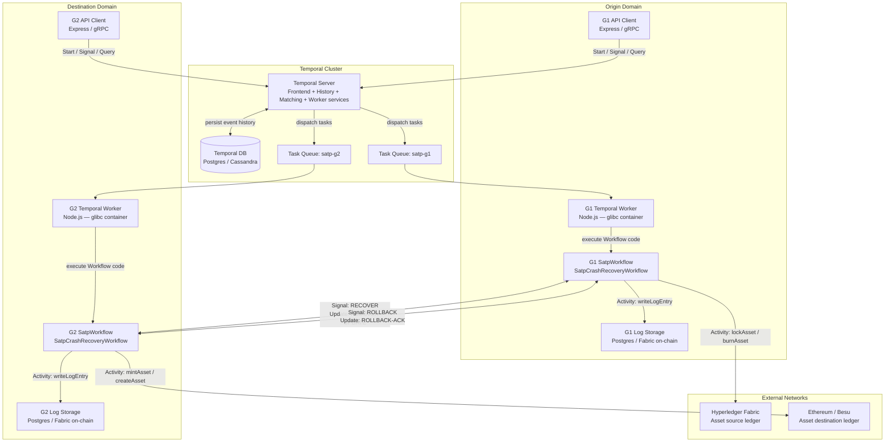
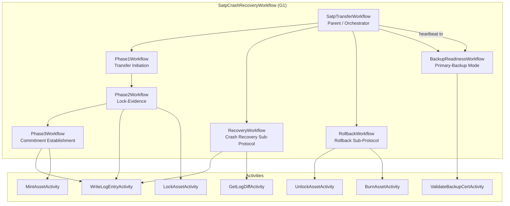
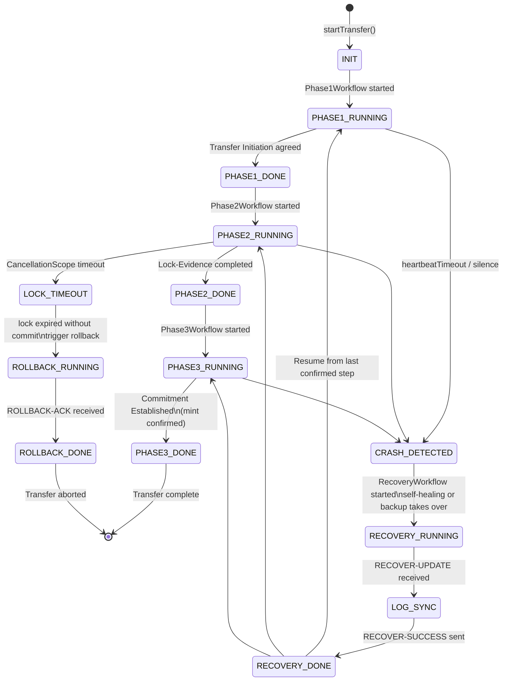
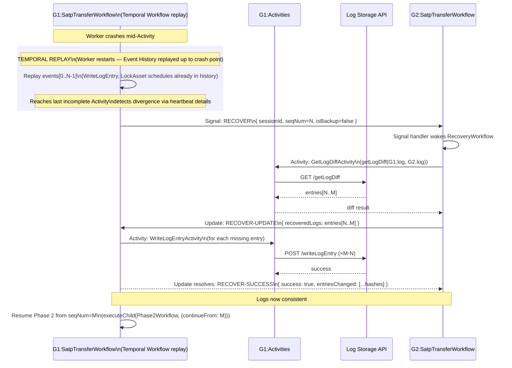
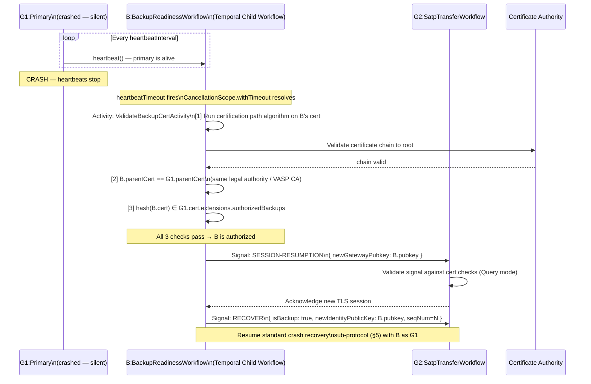
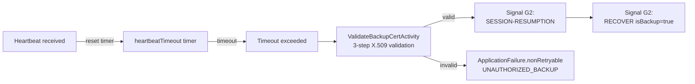
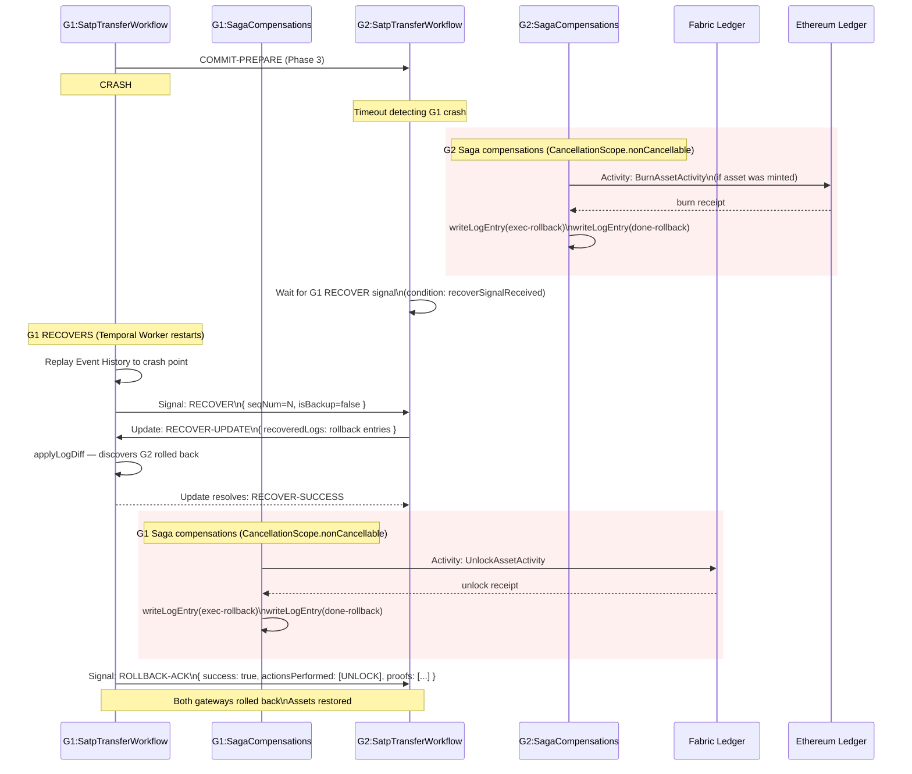

# Temporal × IETF SATP Crash Recovery — Integration Architecture

> This document maps IETF `draft-belchior-satp-gateway-recovery-04` concepts to  
> Temporal TypeScript SDK primitives. Read alongside:  
> - [temporal-ts.md](./temporal-ts.md) — Temporal SDK reference  
> - [ietf-crash-recovery.md](./ietf-crash-recovery.md) — IETF draft reference

---

## Table of Contents

1. [Concept Mapping](#1-concept-mapping)
2. [Component Architecture](#2-component-architecture)
3. [Workflow Hierarchy](#3-workflow-hierarchy)
4. [SATP Session State Machine](#4-satp-session-state-machine)
5. [Self-Healing: Crash Recovery Flow](#5-self-healing-crash-recovery-flow)
6. [Primary-Backup: Handover Flow](#6-primary-backup-handover-flow)
7. [Rollback Sub-Protocol Flow](#7-rollback-sub-protocol-flow)
8. [Data Model — TypeScript Interfaces](#8-data-model--typescript-interfaces)
9. [Key Design Decisions](#9-key-design-decisions)

---

## 1. Concept Mapping

| IETF Draft Concept | Temporal Primitive | Rationale |
|---|---|---|
| **LogEntry** | Activity heartbeat detail | Heartbeats carry arbitrary details (JSON) and are checkpointed per execution; if Activity is retried, the last heartbeat `details` provides resume context — exactly like a pre-execution log entry. |
| **writeLogEntry (init-\*)** | Activity heartbeat at start | Call `context.heartbeat({ operation: 'init-...' })` at the top of each activity. |
| **writeLogEntry (done-\*)** | Activity return value | A successfully completed Activity writes its outcome to Workflow history — the Temporal Event Log equivalent of a `done-*` log entry. |
| **RECOVER** message | Workflow Signal | Fire-and-forget; the recovered workflow (or backup) notifies the counterparty workflow that it is ready to resume. Signal is non-blocking on the sender side. |
| **RECOVER-UPDATE** message | Workflow Update (request/response) | Returns the log diff synchronously in response. Update handler is durable and its execution is recorded in the event history. |
| **RECOVER-SUCCESS** message | Update return value | The resolved value of the `RECOVER-UPDATE` Update call. |
| **ROLLBACK** / **ROLLBACK-ACK** | Saga compensation activities | `nonCancellable` activities that burn/unlock assets; the ack is another compensation activity on the counterparty side. |
| **Log Storage API** | External service Activity | Wraps `writeLogEntry`, `getLogDiff`, etc. as idempotent Activity calls behind a LogStorageClient. |
| **Self-healing recovery** | Workflow replay | On Worker restart after crash, Temporal replays Event History up to the last recorded step — matching the draft's concept of "executing from the last logged action". |
| **Primary-backup detection** | Heartbeat timeout | `scheduleToCloseTimeout` / `heartbeatTimeout` signal backup take-over; mirrors the IETF heartbeat timeout used to detect primary failure. |
| **Primary-backup takeover** | Child Workflow (backup gateway)| Backup runs as a parallel Child Workflow; on primary timeout, backup Child Workflow receives Signal to become the active gateway and runs Session Resumption. |
| **ACP timeout (lock expiry)** | `CancellationScope.withTimeout` | Wraps lock-phase activities; if the timer fires before the lock completes, the scope is cancelled and rollback activities are triggered. |
| **Recovery dispute** | Non-retryable ApplicationFailure | When log inconsistency is detected, throw `ApplicationFailure.nonRetryable('RECOVER-DISPUTE')` to halt the workflow for human resolution. |
| **X.509 backup validation** | Dedicated Validation Activity | Three-step cert chain check runs as an Activity so it has its own retry policy and result is reliably persisted. |
| **Session state query** | Workflow Query | `defineQuery('getSessionState')` returns current SATP phase, operation stack, and log metadata synchronously without advancing the Workflow. |

---

## 2. Component Architecture



---

## 3. Workflow Hierarchy



**Workflow design rules**:
- Each Phase Workflow is a Child Workflow — failure in one cannot corrupt parent state.
- `RecoveryWorkflow` is **not** started unless a crash is detected; it is triggered by a Signal from the counterparty or by heartbeat timeout detection.
- `BackupReadinessWorkflow` runs _in parallel_ from the start of a transfer, receiving heartbeats from the primary and transitioning to active on timeout.

---

## 4. SATP Session State Machine



---

## 5. Self-Healing: Crash Recovery Flow

**Scenario**: G1 crashes during Phase 2 (after writing `init-lockAsset` but before G1 receives `done-lockAsset` confirmation from G2). G1 restarts. G2's log has advanced; G1's has not.



### Signal vs Update decision

| Step | Message | Temporal Mechanism | Why |
|---|---|---|---|
| G1 notifies G2 it recovered | RECOVER | **Signal** | Notification only; G1 does not block. The signal wakes G2's `RecoveryWorkflow`. |
| G2 sends log diff to G1 | RECOVER-UPDATE | **Update** | G1 needs to block until the diff arrives; Update is durable and its handler execution is recorded in history. |
| G1 confirms logs synced | RECOVER-SUCCESS | **Update resolved value** | The result value of the Update call constitutes the acknowledgment. |

---

## 6. Primary-Backup: Handover Flow

**Scenario**: Primary gateway (G1) crashes. Backup gateway (B) detects the crash via heartbeat timeout. B validates its X.509 certificate chain and takes over.



### Backup activation conditions



---

## 7. Rollback Sub-Protocol Flow

**Scenario**: G1 sends `COMMIT-PREPARE` to G2 (Phase 3). G1 crashes. G2 detects via timeout. G2 executes rollback and sends ROLLBACK to G1 when G1 recovers.



### Saga compensation pattern in TypeScript

```typescript
import {
  proxyActivities,
  CancellationScope,
  isCancellation,
  ActivityFailure,
} from "@temporalio/workflow";

const { lockAsset, unlockAsset, mintAsset, burnAsset, writeLogEntry } =
  proxyActivities<SatpActivities>({ startToCloseTimeout: "60 seconds" });

// Rollback list — built up as transfer progresses
const compensations: Array<() => Promise<void>> = [];

async function satpPhase3Workflow(ctx: SatpContext): Promise<void> {
  // Phase 3 step 1: lock asset on origin ledger
  compensations.unshift(() => unlockAsset(ctx.assetId)); // register compensation first
  await lockAsset(ctx.assetId);
  await writeLogEntry({ ...ctx, operation: "done-lockAsset" });

  // Phase 3 step 2: mint asset on destination ledger
  compensations.unshift(() => burnAsset(ctx.mintedAssetId));
  const mintedId = await mintAsset(ctx.assetDefinition);
  await writeLogEntry({ ...ctx, operation: "done-mintAsset" });

  // Phase 3 step 3: commit — may timeout if counterparty crashes
  try {
    await commitEstablishment(ctx);
  } catch (err) {
    if (err instanceof ActivityFailure || isCancellation(err)) {
      // Execute compensations in LIFO order; use nonCancellable so they
      // run even if the workflow is being cancelled
      await CancellationScope.nonCancellable(async () => {
        for (const compensate of compensations) {
          await compensate();
        }
      });
      await writeLogEntry({ ...ctx, operation: "done-rollback" });
      throw err; // re-throw to notify parent workflow
    }
    throw err;
  }
}
```

---

## 8. Data Model — TypeScript Interfaces

### 8.1 ILogEntry

Maps all 26 mandatory + 2 optional fields from §4 of the IETF draft.

```typescript
/** SATP Phase values from SATP Core draft */
type SatpPhase =
  | "transfer-initiation"
  | "transfer-commence"
  | "lock-assertion"
  | "lock-assertion-receipt"
  | "commitment-prepare"
  | "commitment-ready"
  | "commitment-final"
  | "transfer-complete";

/** Operation types matching IETF draft §3 */
type LogOperation =
  | `init-${string}`
  | `exec-${string}`
  | `done-${string}`
  | `ack-${string}`
  | `fail-${string}`;

/** Full LogEntry as defined in draft-belchior-satp-gateway-recovery-04 §4 */
export interface ILogEntry {
  // --- SATP schema fields (from SATP Core) ---
  version: string;                  // SATP protocol version (major.minor)
  sessionId: string;                // UUID v2 unique session identifier
  contextId: string;                // UUID v2 from setup stage
  seqNumber: number;                // monotonically increasing per message
  satpPhase: SatpPhase;             // current protocol phase
  resourceURL: string;              // resource location
  developerURN: string;             // developer/app identity assertion
  actionResponse: string;           // HTTP method + args, or response code
  credentialProfile: "SAML" | "OAuth" | "X.509";
  credentialBlock: string;          // auth token or certificate
  payloadProfile: string;           // asset provenance + capabilities
  applicationProfile: string;       // vendor/app profile
  payload: Record<string, unknown>; // phase-specific payload
  payloadHash: string;              // SHA-256 of payload

  // --- Crash recovery required fields ---
  timestamp: number;                // UNIX timestamp
  originGatewayPubkey: string;      // origin gateway public key (hex or PEM)
  originGatewaySystem: string;      // source network identifier
  destinationGatewayPubkey: string; // destination gateway public key
  destinationGatewaySystem: string; // destination network identifier
  loggingProfile: string;           // log storage mode (default: "Local Store")
  messageSignature: string;         // ECDSA signature of this entry by its writer
  lastEntryHash: string;            // SHA-256 of previous log entry (chain)
  accessControlProfile: string;     // confidentiality profile (default: "GatewayOnly")
  operation: LogOperation;          // init-* | exec-* | done-* | ack-* | fail-*

  // --- Optional crash recovery fields ---
  recoveryMessage?: string;         // recovery message type if in recovery procedure
  recoveryPayload?: Record<string, unknown>; // recovery payload
}
```

### 8.2 IRecoverMessage

```typescript
export interface IRecoverMessage {
  sessionId: string;
  contextId: string;
  messageType: "urn:ietf:SATP-2pc:msgtype:recover-msg";
  satpPhase: SatpPhase;
  seqNumber: number;
  isBackup: boolean;
  newIdentityPublicKey?: string;    // if isBackup === true
  lastEntryTimestamp: number;
  senderSignature: string;
}
```

### 8.3 IRecoverUpdateMessage

```typescript
export interface IRecoverUpdateMessage {
  sessionId: string;
  contextId: string;
  messageType: "urn:ietf:SATP-2pc:msgtype:recover-update-msg";
  hashRecoverMessage: string;       // SHA-256 of received RECOVER message
  recoveredLogs: ILogEntry[];       // missing log entries (diff result)
  senderSignature: string;
}
```

### 8.4 IRecoverSuccessMessage

```typescript
export interface IRecoverSuccessMessage {
  sessionId: string;
  contextId: string;
  messageType: "urn:ietf:SATP-2pc:msgtype:recover-update-ack-msg";
  hashRecoverUpdateMessage: string; // SHA-256 of received RECOVER-UPDATE
  success: boolean;                 // false triggers RECOVER-DISPUTE
  entriesChanged: string[];         // array of hashes of applied entries
  senderSignature: string;
}
```

### 8.5 IRollbackMessage

```typescript
export interface IRollbackMessage {
  sessionId: string;
  contextId: string;
  messageType:
    | "urn:ietf:SATP-2pc:msgtype:rollback-msg"
    | "urn:ietf:SATP-2pc:msgtype:rollback-ack-msg";
  success: boolean;
  actionsPerformed: Array<"UNLOCK" | "BURN" | "REVERT" | string>;
  proofs: Array<{ networkId: string; txId: string; proof: string }>;
  senderSignature: string;
}
```

### 8.6 Workflow Signal & Update Definitions

```typescript
import { defineSignal, defineUpdate, defineQuery } from "@temporalio/workflow";

// Signals (fire-and-forget, no return value)
export const recoverSignal =
  defineSignal<[IRecoverMessage]>("RECOVER");
export const rollbackAckSignal =
  defineSignal<[IRollbackMessage]>("ROLLBACK-ACK");
export const sessionResumptionSignal =
  defineSignal<[{ newGatewayPubkey: string }]>("SESSION-RESUMPTION");

// Updates (durable, return a value)
export const recoverUpdateUpdate =
  defineUpdate<IRecoverSuccessMessage, [IRecoverUpdateMessage]>("RECOVER-UPDATE");
export const rollbackUpdate =
  defineUpdate<IRollbackMessage, [IRollbackMessage]>("ROLLBACK");

// Queries (read-only, synchronous, no side effects)
export const getSessionStateQuery =
  defineQuery<ISatpSessionState>("getSessionState");
export const getRollbackListQuery =
  defineQuery<string[]>("getRollbackList");
```

---

## 9. Key Design Decisions

### 9.1 Why Signals for RECOVER and ROLLBACK-ACK?

The IETF draft describes RECOVER as a message that the crashed/recovered gateway sends to the counterparty to _notify_ it of recovery. The counterparty then initiates the differential log sync. This is semantically equivalent to a **Temporal Signal**: unidirectional, fire-and-forget, durably queued, and does not block the sender.

ROLLBACK-ACK is also a fire-and-forget acknowledgment — using a Signal models this correctly.

### 9.2 Why Updates for RECOVER-UPDATE and ROLLBACK?

RECOVER-UPDATE and ROLLBACK require the sender to **block until a response is received** and the response must be **durably recorded** in the Workflow's event history. Temporal Updates satisfy both requirements:
- The Update handler executes as a step in the Workflow — recorded in history.
- The return value provides the sync response (log diff / rollback proofs).
- Unlike Signals, failed Updates can be retried without duplicating side effects (idempotency via Workflow history).

### 9.3 Determinism in Recovery Workflows

Crash recovery Workflows must be deterministic (required by Temporal) AND must handle log entries from an external source. The pattern:

1. **Log diff fetching** happens in an Activity (non-deterministic I/O).
2. The diff result is **returned to the Workflow** and stored in event history.
3. The Workflow **applies the diff** to its own in-memory state deterministically.
4. **Writing updated entries** happens in another Activity.

This preserves Temporal's determinism constraint while handling arbitrary log content.

### 9.4 Log Chaining Integrity

Each `ILogEntry` contains `lastEntryHash` pointing to the previous entry. This hash chain is verified by the `WriteLogEntryActivity` before appending:

```typescript
// In WriteLogEntryActivity:
const lastEntry = await logStorageClient.getLastEntry(sessionId);
const expectedHash = sha256(JSON.stringify(lastEntry));
if (entry.lastEntryHash !== expectedHash) {
  throw ApplicationFailure.nonRetryable(
    "LOG_CHAIN_BROKEN",
    `lastEntryHash mismatch: expected ${expectedHash}`
  );
}
```

A broken hash chain triggers a non-retryable failure — the equivalent of `RECOVER-DISPUTE` in the IETF draft.

### 9.5 Crash Detection Timeout Tuning

| Parameter | IETF Concept | Temporal Setting | Guidance |
|---|---|---|---|
| Heartbeat between G1↔Backup | Heartbeat between primary and backup | `heartbeatTimeout` on `BackupHeartbeatActivity` | Must be << lock expiry timeout |
| Lock phase deadline | Lock timeout (asset locked on ledger) | `CancellationScope.withTimeout(lockDuration)` | Set to ledger's configured lock TTL minus safety margin |
| Recovery phase deadline | Recovery must complete before lock expires | Total of RECOVER + RECOVER-UPDATE + RECOVER-SUCCESS RTT | Sum RTT bounds; if exceeded, trigger rollback |
| RECOVER message retry | Reliable delivery of RECOVER | `startToCloseTimeout` on activities | Short (5–10 s), high retry count |
