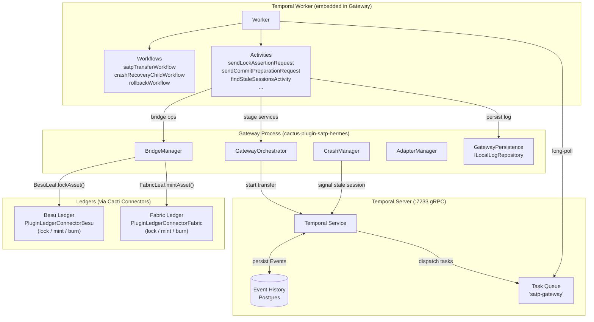

# Temporal in SATP-Hermes — Knowledge Base

> Temporal TypeScript SDK applied to the **SATP-Hermes** gateway plugin  
> in the **Hyperledger Cacti** monorepo.
>
> Source: [docs.temporal.io](https://docs.temporal.io/develop/typescript/) — captured March 2026  
> SDK version: `@temporalio/*` ≥ 1.11.x (Node.js ≥ 18, glibc-based image only)  
> IETF reference: draft-ietf-satp-core-13, draft-belchior-satp-gateway-recovery-04

---

## Table of Contents

1. [Why Temporal for SATP-Hermes](#1-why-temporal-for-satp-hermes)
2. [Architecture — Temporal Inside a SATP Gateway](#2-architecture--temporal-inside-a-satp-gateway)
3. [Mapping SATP Stages to Workflows](#3-mapping-satp-stages-to-workflows)
4. [Mapping Cacti Connector Operations to Activities](#4-mapping-cacti-connector-operations-to-activities)
5. [Crash Recovery — The HERMES Sub-Protocol](#5-crash-recovery--the-hermes-sub-protocol)
6. [Failure Handling and Saga Compensation](#6-failure-handling-and-saga-compensation)
7. [Message Passing — Signals, Queries, Updates](#7-message-passing--signals-queries-updates)
8. [Worker Configuration for SATP Gateways](#8-worker-configuration-for-satp-gateways)
9. [Testing SATP Workflows](#9-testing-satp-workflows)
10. [Key APIs Reference](#10-key-apis-reference)

---

## 1. Why Temporal for SATP-Hermes

### 1.1 The Problem: Cross-Chain Atomicity

SATP (Secure Asset Transfer Protocol) transfers assets between heterogeneous
ledgers (e.g., Hyperledger Besu ↔ Hyperledger Fabric). A single transfer
touches multiple blockchains, exchanges cryptographic proofs, and must survive
gateway crashes without leaving assets locked or duplicated. The requirements:

| SATP Requirement | What Can Go Wrong | Traditional Approach |
|---|---|---|
| **Atomicity** across ledgers | Gateway crashes between lock and mint | Manual retry scripts, operator intervention |
| **Exactly-once** ledger operations | Duplicate mint if retry is naïve | Ad-hoc idempotency tables in each connector |
| **Ordered stage progression** | Race conditions in concurrent sessions | Mutex locks, brittle state machines |
| **Crash recovery** (IETF §5) | Lost session state, log divergence | Custom persistence + polling loops |
| **Rollback** after partial failure | Locked assets never released | Compensating cron jobs |
| **Observability** per session | Opaque failures in multi-hour transfers | Log scraping, manual DB queries |

### 1.2 What Temporal Provides

Temporal's **durable execution** model addresses every row above:

- **Durable state**: Every Workflow step (Activity schedule, timer, Signal
  received) is recorded as an **Event** in an append-only Event History on the
  Temporal Server. On crash/restart, the Worker replays the history
  deterministically — the Workflow resumes exactly where it left off.
- **Activity retry with backoff**: Ledger operations (lock, mint, burn) are
  Activities with configurable retry policies. Transient Besu/Fabric RPC
  failures are retried automatically — permanent failures surface as typed
  errors.
- **Saga compensation**: SATP's rollback sub-protocol maps directly to
  Temporal's Saga pattern — a try/catch with `CancellationScope.nonCancellable`
  compensation blocks that cannot be interrupted.
- **Signals for inter-gateway messaging**: RECOVER, RECOVER-UPDATE, and
  ROLLBACK-ACK messages from the counterparty gateway arrive as Temporal
  Signals, durably recorded in Event History.
- **Queries for observability**: `transferSessionStateQuery` and
  `transferLogQuery` expose live session state without touching the database.
- **Child Workflows**: Crash recovery and rollback run as Child Workflows
  with their own Event History, visible in the Temporal Web UI.

### 1.3 Temporal vs Alternatives for SATP

| Concern | Temporal | Bull/BullMQ + Redis | Custom Knex state machine |
|---|---|---|---|
| Crash recovery | Built-in (Event History replay) | Manual; Redis flush = lost jobs | Must code: poll DB, detect stale rows |
| Multi-step orchestration | Workflow code = sequential logic | Chain of separate queue jobs | Giant switch/case on `session.state` |
| Retry with backoff | Activity retry policy (declarative) | Per-queue retry config | Manual retry loop per operation |
| Saga compensation | try/catch + nonCancellable scope | Separate "undo" queue consumers | Must track `rollbackList[]` in DB |
| Observability | Web UI per Workflow, Queries | Redis Insight + custom dashboard | SQL queries on session table |
| Timer durability | Survives process restart | Lost if Redis not persistent | cron job to scan for expired timers |
| Determinism guarantee | V8 sandbox enforces it | N/A (all code in same runtime) | N/A |

**Bottom line**: Temporal eliminates an entire class of crash-recovery and
state-machine code that SATP-Hermes would otherwise have to build and maintain
on top of Knex. The gateway persistence layer (`GatewayPersistence`,
`ILocalLogRepository`) remains as the **application-level audit log** — Temporal
handles the **orchestration-level durability**.

### 1.4 Core Execution Model

**Workflow code must be deterministic** — no `Math.random()`, no `new Date()`,
no direct network calls. All I/O goes through Activities. The SDK patches
`Math.random()` and `Date` inside the V8 sandbox to be replay-safe.

| Concern | Workflow (V8 sandbox) | Activity (Node.js) |
|---|---|---|
| Runs in | Deterministic V8 isolate | Normal Node.js runtime |
| Persistence | Event History (append-only) | Heartbeat checkpoints |
| Network calls | ❌ forbidden | ✅ allowed |
| Retry | Transparent (task replay) | Configurable retry policy |
| State | In-memory variables (durable via replay) | Must be re-computed or heartbeated |
| Duration | Hours → years | Milliseconds → hours |

---

## 2. Architecture — Temporal Inside a SATP Gateway



**Key insight**: The Worker is embedded in the gateway process. Activities
call back into the gateway's own services (`Stage1ClientService`,
`BridgeManager`, `GatewayPersistence`) — Temporal orchestrates the order and
handles retries; the gateway owns the business logic.

---

## 3. Mapping SATP Stages to Workflows

### 3.1 The `satpTransferWorkflow`

Each SATP transfer is a single Temporal Workflow instance identified by
`satp-transfer-${sessionId}`. The Workflow drives all four stages sequentially,
with Signal handlers for crash recovery and rollback interrupts.

```typescript
// Simplified from src/main/typescript/temporal/workflows/satp-transfer-workflow.ts

import {
  proxyActivities,
  defineSignal,
  defineQuery,
  setHandler,
  condition,
  startChild,
  CancellationScope,
} from "@temporalio/workflow";
import type { TransferActivities } from "../activities";

// Activity proxy — all Cacti connector calls go through here
const {
  sendNewSessionRequest,          // Stage 0: Gateway negotiation
  sendPreSatpTransferRequest,     // Stage 0: Pre-transfer validation
  sendTransferProposalRequest,    // Stage 1: Transfer proposal
  sendTransferCommenceRequest,    // Stage 1: Transfer commencement
  sendLockAssertionRequest,       // Stage 2: Lock asset on source chain
  sendCommitPreparationRequest,   // Stage 3: Prepare commitment on dest
  sendCommitFinalAssertionRequest,// Stage 3: Finalize commitment
  sendTransferCompleteRequest,    // Stage 3: Confirm completion
} = proxyActivities<TransferActivities>({
  startToCloseTimeout: "2 minutes",
  retry: { maximumAttempts: 3 },
});

// Signals from counterparty gateway (crash recovery / rollback)
export const recoverRequestSignal = defineSignal("recoverRequest");
export const rollbackRequestSignal = defineSignal("rollbackRequest");

// Queries for observability (sync, read-only)
export const transferSessionStateQuery = defineQuery<string>("transferSessionState");
export const transferLogQuery = defineQuery<string[]>("transferLog");

export async function satpTransferWorkflow(sessionId: string): Promise<void> {
  let state = "INIT";
  const log: string[] = [];
  let recoverRequested = false;
  let rollbackRequested = false;

  // Register handlers BEFORE any await (determinism requirement)
  setHandler(transferSessionStateQuery, () => state);
  setHandler(transferLogQuery, () => [...log]);
  setHandler(recoverRequestSignal, () => { recoverRequested = true; });
  setHandler(rollbackRequestSignal, () => { rollbackRequested = true; });

  // --- Stage 0: Transfer Initiation ---
  state = "STAGE0";
  await sendNewSessionRequest(sessionId);
  log.push("STAGE0_SESSION_CREATED");

  await sendPreSatpTransferRequest(sessionId);
  log.push("STAGE0_PRE_TRANSFER_VALIDATED");

  // --- Stage 1: Transfer Proposal & Commencement ---
  state = "STAGE1_PROPOSED";
  await sendTransferProposalRequest(sessionId);
  log.push("STAGE1_PROPOSAL_SENT");

  await sendTransferCommenceRequest(sessionId);
  log.push("STAGE1_COMMENCED");

  // --- Stage 2: Lock Assertion ---
  // This Activity calls BridgeManager → BesuLeaf.lockAsset()
  state = "STAGE2_LOCKING";
  await sendLockAssertionRequest(sessionId);
  log.push("STAGE2_LOCKED");

  // --- Stage 3: Commitment ---
  // This Activity calls BridgeManager → FabricLeaf.mintAsset() (or vice versa)
  state = "STAGE3_PREPARED";
  await sendCommitPreparationRequest(sessionId);
  log.push("STAGE3_COMMIT_PREPARED");

  await sendCommitFinalAssertionRequest(sessionId);
  log.push("STAGE3_COMMIT_FINALIZED");

  await sendTransferCompleteRequest(sessionId);
  state = "COMPLETED";
  log.push("TRANSFER_COMPLETE");
}
```

### 3.2 Stage-to-Activity Mapping

| SATP Stage | Activity | Cacti Layer Invoked | Ledger Operation |
|---|---|---|---|
| **Stage 0** — Initiation | `sendNewSessionRequest` | `GatewayOrchestrator.sendMessage()` | None (gateway-to-gateway negotiation) |
| **Stage 0** — Pre-transfer | `sendPreSatpTransferRequest` | `Stage0ServerService` | Network verification, route validation |
| **Stage 1** — Proposal | `sendTransferProposalRequest` | `Stage1ClientService` | None (message exchange) |
| **Stage 1** — Commence | `sendTransferCommenceRequest` | `Stage1ServerService` | None (message exchange) |
| **Stage 2** — Lock | `sendLockAssertionRequest` | `BridgeManager` → `BesuLeaf.lockAsset()` | **Besu**: `invokeContract(wrapperContract, "lock", [assetId, gatewayAddress])` |
| **Stage 3** — Prepare | `sendCommitPreparationRequest` | `BridgeManager` → `FabricLeaf.mintAsset()` | **Fabric**: `submitTransaction("mint", assetId, beneficiary)` |
| **Stage 3** — Finalize | `sendCommitFinalAssertionRequest` | `Stage3ServerService` | Commit receipt exchange |
| **Stage 3** — Complete | `sendTransferCompleteRequest` | `BridgeManager` → `BesuLeaf.burnAsset()` | **Besu**: `invokeContract(wrapperContract, "burn", [assetId])` |

---

## 4. Mapping Cacti Connector Operations to Activities

### 4.1 Besu Connector as Activity Substrate

The `PluginLedgerConnectorBesu` from `cactus-plugin-ledger-connector-besu`
provides two core operations that SATP-Hermes wraps as Activities:

```typescript
// Besu connector public API
class PluginLedgerConnectorBesu {
  // Deploy a Solidity contract (wrapper contracts for SATP bridge)
  async deployContract(req: DeployContractSolidityBytecodeV1Request):
    Promise<DeployContractSolidityBytecodeV1Response>;

  // Invoke a contract method (lock, mint, burn, assign)
  async invokeContract(req: InvokeContractV1Request):
    Promise<InvokeContractV1Response>;

  // Run a raw transaction
  async transact(req: RunTransactionRequest):
    Promise<RunTransactionResponse>;
}
```

### 4.2 Bridge Leaf → Activity Pattern

The `BesuLeaf` class wraps the Besu connector for SATP-specific operations.
Each Bridge Leaf method becomes the body of a Temporal Activity:

```typescript
// src/main/typescript/temporal/activities/bridge-activities.ts
import { heartbeat } from "@temporalio/activity";

// These are Activity functions — normal Node.js, I/O allowed
// They are called by the Workflow via proxyActivities()

export async function lockAssetOnBesu(
  sessionId: string,
  assetId: string,
  targetGateway: string,
): Promise<TransactionResponse> {
  // 1. BesuLeaf calls PluginLedgerConnectorBesu.invokeContract()
  //    Contract method: wrapper.lock(assetId, gatewayAddress)
  const response = await besuLeaf.lockAsset(
    { id: assetId, type: "ERC20" },
    targetGateway,
  );

  // 2. Heartbeat with transaction ID — enables resume on retry
  heartbeat({ txId: response.transactionId });

  // 3. Persist lock proof to local log
  await gatewayPersistence.storeProof({
    sessionId,
    type: "LOCK_ASSERTION",
    operation: "done",
    data: JSON.stringify(response),
    sequenceNumber: nextSeqNum(),
  });

  return response;
}

export async function mintAssetOnBesu(
  sessionId: string,
  assetId: string,
  beneficiary: string,
): Promise<TransactionResponse> {
  // BesuLeaf calls PluginLedgerConnectorBesu.invokeContract()
  // Contract method: wrapper.mint(assetId, beneficiary)
  const response = await besuLeaf.mintAsset(
    { id: assetId, type: "ERC20" },
    beneficiary,
  );

  heartbeat({ txId: response.transactionId });

  await gatewayPersistence.storeProof({
    sessionId,
    type: "COMMIT_PREPARATION",
    operation: "done",
    data: JSON.stringify(response),
    sequenceNumber: nextSeqNum(),
  });

  return response;
}

export async function burnAssetOnBesu(
  sessionId: string,
  assetId: string,
): Promise<TransactionResponse> {
  // Contract method: wrapper.burn(assetId)
  return besuLeaf.burnAsset({ id: assetId, type: "ERC20" });
}

export async function unlockAssetOnBesu(
  sessionId: string,
  assetId: string,
): Promise<TransactionResponse> {
  // Compensation Activity — called during rollback
  // Contract method: wrapper.unlock(assetId)
  return besuLeaf.unlockAsset({ id: assetId, type: "ERC20" });
}
```

### 4.3 Besu Wrapper Contract Deployment as Activity

```typescript
export async function deployWrapperContractOnBesu(
  contractName: string,
  fungible: boolean,
): Promise<{ contractAddress: string }> {
  // BesuLeaf → PluginLedgerConnectorBesu.deployContract()
  const response = fungible
    ? await besuLeaf.deployFungibleWrapperContract(contractName)
    : await besuLeaf.deployNonFungibleWrapperContract(contractName);

  return { contractAddress: response.transactionId };
}
```

### 4.4 Activity Retry Configuration by Operation Type

Different ledger operations have different failure profiles:

```typescript
// Quick reads — low timeout, many retries (Besu RPC may be temporarily unavailable)
const { getAssetProof } = proxyActivities<typeof activities>({
  startToCloseTimeout: "30s",
  retry: {
    maximumAttempts: 10,
    initialInterval: "2s",
    backoffCoefficient: 2,
    maximumInterval: "30s",
  },
});

// State-changing operations — longer timeout, fewer retries
// (lock/mint are idempotent via wrapper contract, but we limit attempts
//  to avoid repeated gas costs on permanent failures)
const { lockAssetOnBesu, mintAssetOnBesu } = proxyActivities<typeof activities>({
  startToCloseTimeout: "2m",
  heartbeatTimeout: "30s",
  retry: {
    maximumAttempts: 3,
    initialInterval: "10s",
    backoffCoefficient: 2,
    nonRetryableErrorTypes: [
      "InsufficientFundsError",
      "ContractNotFoundError",
      "InvalidAssetError",
    ],
  },
});

// Compensation activities — MUST succeed; more retries, longer timeout
const { unlockAssetOnBesu, burnAssetOnBesu } = proxyActivities<typeof activities>({
  startToCloseTimeout: "5m",
  retry: {
    maximumAttempts: 20,
    initialInterval: "5s",
    backoffCoefficient: 2,
    maximumInterval: "2m",
  },
});
```

### 4.5 Full Mapping: Cacti Connector → Bridge Leaf → Activity → Workflow

```
┌─────────────────────────────────────────────────────────────────────┐
│  satpTransferWorkflow(sessionId)                                    │
│                                                                     │
│  Stage 2: await sendLockAssertionRequest(sessionId)                │
│           ↓                                                        │
│  ┌──── Activity ──────────────────────────────────────────────┐    │
│  │  sendLockAssertionRequest(sessionId)                       │    │
│  │    ↓                                                       │    │
│  │  Stage2ClientService.lockAssertion(session)                │    │
│  │    ↓                                                       │    │
│  │  BridgeManager.getLeaf("besu-network-1")                  │    │
│  │    ↓                                                       │    │
│  │  BesuLeaf.lockAsset(asset, targetGateway)                  │    │
│  │    ↓                                                       │    │
│  │  PluginLedgerConnectorBesu.invokeContract({                │    │
│  │    contractName: "SATPWrapperERC20",                       │    │
│  │    keychainId: "...",                                      │    │
│  │    invocationType: EthContractInvocationType.Send,         │    │
│  │    methodName: "lock",                                     │    │
│  │    params: [assetId, gatewayPubKey],                       │    │
│  │    gas: 1_000_000,                                         │    │
│  │  })                                                        │    │
│  │    ↓                                                       │    │
│  │  { success: true, transactionId: "0xabc...", ... }         │    │
│  └────────────────────────────────────────────────────────────┘    │
│                                                                     │
│  ← ActivityTaskCompleted event stored in Temporal History           │
│  ← On crash replay: result returned from History, Besu NOT called  │
└─────────────────────────────────────────────────────────────────────┘
```

---

## 5. Crash Recovery — The HERMES Sub-Protocol

### 5.1 Why Temporal Is the Right Fit for SATP Crash Recovery

The IETF SATP crash recovery specification (draft-belchior-satp-gateway-recovery-04)
defines a four-message sub-protocol: RECOVER → RECOVER-UPDATE → RECOVER-SUCCESS.
This maps naturally to Temporal primitives:

| Recovery Step | Temporal Primitive | Why |
|---|---|---|
| Detect stale session | Scheduled Activity (`findStaleSessionsActivity`) | Heartbeat-like polling, durable across restarts |
| Send RECOVER to counterparty | Activity (`sendRecoverActivity`) | Retryable RPC call |
| Wait for RECOVER-UPDATE | `condition()` with timeout | Durable timer, survives crash |
| Apply log diff | Activity (`applyLogDiffActivity`) | DB write with retry |
| Escalate to rollback on timeout | `startChild(rollbackWorkflow)` | Independent lifecycle |
| ROLLBACK compensation | Saga pattern with `CancellationScope.nonCancellable` | Cleanup cannot be interrupted |

Without Temporal, each of these steps requires custom persistence, polling
loops, and retry logic — all of which the `CrashManager` would have to
implement from scratch on top of Knex.

### 5.2 Crash Detection: Monitor Workflow

The `CrashManager` starts a monitoring Workflow that periodically scans for
stale sessions and triggers recovery:

```typescript
// Simplified from src/main/typescript/temporal/activities/monitor-activities.ts

export async function findStaleSessionsActivity(
  staleThresholdMs: number,
): Promise<string[]> {
  // Query the local log repository for sessions without recent activity
  const cutoffDate = new Date(Date.now() - staleThresholdMs);
  const allSessions = await localRepository.readLogsNotProofs();
  const recentSessions = await localRepository.readLogsMoreRecentThanTimestamp(
    cutoffDate.toISOString(),
  );
  // Sessions in allSessions but NOT in recentSessions → stale
  return allSessions.filter((id) => !recentSessions.includes(id));
}

export async function signalStaleSessionActivity(
  sessionId: string,
): Promise<void> {
  // Signal the running satpTransferWorkflow to enter recovery mode
  const handle = temporalClient.workflow.getHandle(
    `satp-transfer-${sessionId}`,
  );
  await handle.signal(recoverRequestSignal, { sessionId });
}
```

### 5.3 Recovery Child Workflow

When the `satpTransferWorkflow` receives a `recoverRequestSignal`, it launches
the crash recovery sub-protocol as a Child Workflow:

```typescript
// Simplified from src/main/typescript/temporal/workflows/crash-recovery-workflow.ts

export async function crashRecoveryChildWorkflow(
  sessionId: string,
  timeoutMs = 30_000,
): Promise<void> {
  let recoverUpdatePayload: { entries: LocalLog[] } | undefined;
  let recoverSuccessReceived = false;

  setHandler(recoverUpdateSignal, (payload) => {
    recoverUpdatePayload = payload;
  });
  setHandler(recoverSuccessSignal, () => {
    recoverSuccessReceived = true;
  });

  // Step 1: Send RECOVER message to counterparty gateway
  await sendRecoverActivity(sessionId);

  // Step 2: Wait for RECOVER-UPDATE (counterparty sends log diff)
  //         condition() is a durable wait — survives crashes
  const updateReceived = await condition(
    () => recoverUpdatePayload !== undefined,
    timeoutMs,
  );
  if (!updateReceived) {
    // Timeout → escalate to rollback as a separate Child Workflow
    await startChild(rollbackWorkflow, { args: [sessionId] });
    return;
  }

  // Step 3: Apply log diff from counterparty
  await applyLogDiffActivity(recoverUpdatePayload!.entries);

  // Step 4: Wait for RECOVER-SUCCESS confirmation
  const successReceived = await condition(
    () => recoverSuccessReceived,
    timeoutMs,
  );
  if (!successReceived) {
    await startChild(rollbackWorkflow, { args: [sessionId] });
    return;
  }
  // Recovery complete — parent Workflow resumes from where it crashed
}
```

### 5.4 Rollback Workflow (Saga Compensation)

```typescript
// Simplified from src/main/typescript/temporal/workflows/rollback-workflow.ts

export async function rollbackWorkflow(
  sessionId: string,
  timeoutMs = 30_000,
): Promise<void> {
  let rollbackAckReceived = false;

  setHandler(rollbackAckSignal, () => {
    rollbackAckReceived = true;
  });

  // Step 1: Execute compensating strategy
  //         Calls BridgeManager → BesuLeaf.unlockAsset() or burnAsset()
  //         Wrapped in nonCancellable — MUST complete even if workflow is cancelled
  await CancellationScope.nonCancellable(async () => {
    await executeRollbackActivity(sessionId);
  });

  // Step 2: Notify counterparty
  await sendRollbackActivity(sessionId);

  // Step 3: Wait for ROLLBACK-ACK
  const ackReceived = await condition(
    () => rollbackAckReceived,
    timeoutMs,
  );
  if (!ackReceived) {
    throw ApplicationFailure.create({
      message: `ROLLBACK-ACK not received within ${timeoutMs}ms`,
      type: "RollbackAckTimeout",
      nonRetryable: true,
    });
  }
}
```

### 5.5 How Temporal Event History Replaces Custom State Persistence

Without Temporal, crash recovery requires:

```
// What you'd have to build WITHOUT Temporal:
1. session_state table with stage column
2. Polling loop to detect stale sessions (cron or setInterval)
3. Retry wrapper around every RPC call
4. Transaction log with sequence numbers
5. Idempotency keys for every ledger operation
6. Mutex to prevent concurrent recovery on same session
7. Timer table for timeouts (scan for expired rows)
8. Compensation queue for rollback operations
```

With Temporal, the Event History IS the session state:

```
WorkflowExecutionStarted          ← session created
ActivityTaskCompleted (Stage0)     ← negotiation done
ActivityTaskCompleted (Stage1)     ← proposal accepted
ActivityTaskCompleted (Stage2)     ← lock TX: 0xabc...
  ← CRASH HERE →
  ← Worker restarts, replays history →
  ← Activities 0, 1, 2 return stored results (NOT re-executed) →
  ← Workflow resumes at Stage 3 →
ActivityTaskScheduled (Stage3)     ← mint TX scheduled
ActivityTaskCompleted (Stage3)     ← mint TX: 0xdef...
WorkflowExecutionCompleted
```

The `GatewayPersistence` layer still stores the **application-level audit
log** (proofs, receipts, protocol messages) — but the **orchestration state
machine** is Temporal's responsibility.

---

## 6. Failure Handling and Saga Compensation

### 6.1 Error Hierarchy in SATP Context

```
Error (JavaScript)
└── ApplicationFailure            ← SATP-specific errors (SessionNotFound, InvalidAsset)
└── TemporalFailure
    ├── ActivityFailure            ← Wraps a Besu/Fabric RPC error
    │   └── cause: ApplicationFailure("Besu: revert ERC20: insufficient balance")
    ├── ChildWorkflowFailure       ← Wraps a crashRecovery/rollback failure
    ├── CancelledFailure           ← Gateway shutdown during transfer
    └── WorkflowFailedError        ← Client-side: transfer ended in failure
```

### 6.2 Non-retryable Failures (Permanent Errors)

```typescript
// In a bridge Activity — asset doesn't exist, don't retry:
throw ApplicationFailure.create({
  message: "Asset not found in wrapper contract",
  type: "InvalidAssetError",
  nonRetryable: true,
});

// Besu RPC rate limited — retry after delay:
throw ApplicationFailure.create({
  message: "Besu RPC rate limited",
  nextRetryDelay: "60 seconds",
});
```

### 6.3 Saga Pattern for SATP Transfer

The Saga pattern is the natural fit for SATP's multi-ledger operations.
Each stage registers its compensation Activity, and on failure the Workflow
unwinds in reverse order:

```typescript
export async function satpTransferSaga(
  sessionId: string,
  sourceLeaf: "besu" | "fabric",
  destLeaf: "besu" | "fabric",
): Promise<void> {
  const compensations: (() => Promise<void>)[] = [];

  try {
    // Stage 2: Lock asset on source chain (e.g., Besu)
    await lockAssetOnBesu(sessionId, assetId, targetGateway);
    compensations.push(() => unlockAssetOnBesu(sessionId, assetId));

    // Stage 3: Mint asset on destination chain (e.g., Fabric)
    await mintAssetOnFabric(sessionId, assetId, beneficiary);
    compensations.push(() => burnAssetOnFabric(sessionId, assetId));

    // Stage 3: Commit finalization
    await sendCommitFinalAssertionRequest(sessionId);

  } catch (err) {
    // Compensate in reverse — nonCancellable ensures cleanup completes
    // even if the Workflow itself is being cancelled (gateway shutdown)
    await CancellationScope.nonCancellable(async () => {
      for (const undo of compensations.reverse()) {
        await undo();
      }
    });
    throw err;
  }
}
```

### 6.4 Catching Besu/Fabric Failures

```typescript
import { ActivityFailure, ApplicationFailure } from "@temporalio/workflow";

try {
  await lockAssetOnBesu(sessionId, assetId, targetGateway);
} catch (err) {
  if (err instanceof ActivityFailure && err.cause instanceof ApplicationFailure) {
    if (err.cause.type === "InsufficientFundsError") {
      // Permanent failure — no point retrying or rolling back
      throw err;
    }
    if (err.cause.type === "TimedOut") {
      // Besu RPC timed out — Temporal already retried per policy
      // Escalate to crash recovery sub-protocol
      await startChild(crashRecoveryChildWorkflow, { args: [sessionId] });
    }
  }
  throw err;
}
```

---

## 7. Message Passing — Signals, Queries, Updates

### 7.1 SATP Messages as Temporal Signals

Signals are fire-and-forget, asynchronous messages that mutate Workflow state.
The counterparty gateway sends SATP protocol messages (RECOVER, ROLLBACK-ACK)
as Signals to the running Workflow:

```typescript
// Define in workflow file
export const recoverRequestSignal =
  defineSignal<[{ sessionId: string }]>("recoverRequest");
export const rollbackRequestSignal =
  defineSignal<[{ sessionId: string }]>("rollbackRequest");
export const rollbackAckSignal =
  defineSignal("rollbackAck");
export const recoverUpdateSignal =
  defineSignal<[{ entries: LocalLog[] }]>("recoverUpdate");
export const recoverSuccessSignal =
  defineSignal("recoverSuccess");

// Handle in workflow body (before any await)
setHandler(recoverRequestSignal, (payload) => {
  recoverRequested = true;
});

// Block until signal arrives or timeout
const fired = await condition(() => recoverRequested, "10 minutes");
```

```typescript
// Counterparty gateway sends signal via Temporal Client
const handle = temporalClient.workflow.getHandle(`satp-transfer-${sessionId}`);
await handle.signal(recoverRequestSignal, { sessionId });
```

### 7.2 Session State Queries (Observability)

Queries are synchronous, read-only — used by the `MonitorService` and
external dashboards to inspect live transfer state:

```typescript
export const transferSessionStateQuery =
  defineQuery<string>("transferSessionState");
export const transferLogQuery =
  defineQuery<string[]>("transferLog");

// In workflow body:
setHandler(transferSessionStateQuery, () => state);
setHandler(transferLogQuery, () => [...log]);
```

```typescript
// Query from CrashManager or monitoring dashboard:
const state = await handle.query(transferSessionStateQuery);
// → "STAGE2_LOCKING"

const log = await handle.query(transferLogQuery);
// → ["STAGE0_SESSION_CREATED", "STAGE1_PROPOSAL_SENT", "STAGE2_LOCKED"]
```

### 7.3 Signal vs Query vs Update for SATP

| SATP Use Case | Primitive | Why |
|---|---|---|
| RECOVER message from counterparty | **Signal** | Fire-and-forget notification |
| RECOVER-UPDATE (log diff) | **Signal** | Delivers payload, no return needed |
| ROLLBACK-ACK | **Signal** | Acknowledgment, no return needed |
| Monitor session state | **Query** | Synchronous read, no mutation |
| Request log diff (interactive) | **Update** | Needs return value + validation |

---

## 8. Worker Configuration for SATP Gateways

### 8.1 Gateway Worker Setup

```typescript
// src/main/typescript/temporal/worker.ts
import { Worker, NativeConnection } from "@temporalio/worker";
import * as transferActivities from "./activities/transfer-activities";
import * as monitorActivities from "./activities/monitor-activities";
import * as bridgeActivities from "./activities/bridge-activities";

const connection = await NativeConnection.connect({
  address: process.env.TEMPORAL_ADDRESS ?? "localhost:7233",
});

const worker = await Worker.create({
  workflowsPath: require.resolve("./workflows"),
  activities: {
    ...transferActivities,  // SATP stage Activities
    ...monitorActivities,   // Crash detection Activities
    ...bridgeActivities,    // Besu/Fabric bridge operations
  },
  taskQueue: process.env.TEMPORAL_TASK_QUEUE ?? "satp-gateway",
  connection,
  namespace: process.env.TEMPORAL_NAMESPACE ?? "default",
  maxConcurrentActivityTaskExecutions: 100,
  maxConcurrentWorkflowTaskExecutions: 40,
  shutdownGraceTime: "30s",     // Allow in-flight Activities to complete
});

await worker.run();
```

### 8.2 Docker Notes for SATP Gateway Images

- **Do not use Alpine**: musl libc is incompatible with the Temporal Rust core.
  Use `node:20-bullseye` or `node:20-bullseye-slim`.
- Set `NODE_OPTIONS=--max-old-space-size=<80%_of_container_mb>`.
- Pre-bundle workflows for production:
  ```typescript
  const bundle = await bundleWorkflowCode({
    workflowsPath: require.resolve("./workflows"),
  });
  // Pass `workflowBundle: bundle` to Worker.create() instead of workflowsPath
  ```

### 8.3 Workflow Determinism Rules

| Allowed in Workflow | Forbidden in Workflow |
|---|---|
| `sleep()` | `setTimeout` / `setInterval` |
| `Math.random()` (SDK-patched) | `crypto.randomUUID()` |
| `new Date()` (SDK-patched) | Direct `fetch` / `http.get` |
| `proxyActivities()` | Direct Besu/Fabric RPC calls |
| `executeChild()` | Direct function calls to other workflows |
| `log` from `@temporalio/workflow` | `console.log` (suppressed on replay) |
| `condition()` with timeout | `setTimeout`-based polling loops |

---

## 9. Testing SATP Workflows

### 9.1 Test Environment Types

| Type | API | SATP Use Case |
|---|---|---|
| Time-skipping | `TestWorkflowEnvironment.createTimeSkipping()` | Crash recovery timeouts, stale session detection |
| Local (real-time) | `TestWorkflowEnvironment.createLocal()` | End-to-end gateway integration tests |
| Mock Activity | `MockActivityEnvironment` | Unit-test bridge Activities without a running ledger |

### 9.2 Testing a Full Transfer Workflow (Time-Skipping)

```typescript
import { TestWorkflowEnvironment } from "@temporalio/testing";
import { Worker } from "@temporalio/worker";

let testEnv: TestWorkflowEnvironment;

beforeAll(async () => {
  testEnv = await TestWorkflowEnvironment.createTimeSkipping();
});

afterAll(async () => {
  await testEnv?.teardown();
});

// Mock bridge Activities — no real Besu or Fabric node needed
const mockBridgeActivities = {
  async sendLockAssertionRequest(sessionId: string) {
    return { success: true, transactionId: "0xmock-lock-tx" };
  },
  async sendCommitPreparationRequest(sessionId: string) {
    return { success: true, transactionId: "0xmock-mint-tx" };
  },
  async sendCommitFinalAssertionRequest(sessionId: string) {},
  async sendTransferCompleteRequest(sessionId: string) {},
  // ... other stage Activities
};

test("satpTransferWorkflow completes all stages", async () => {
  const taskQueue = "test-satp-transfer";

  const worker = await Worker.create({
    connection: testEnv.nativeConnection,
    taskQueue,
    workflowsPath: require.resolve("../workflows/satp-transfer-workflow"),
    activities: mockBridgeActivities,
  });

  await worker.runUntil(
    testEnv.client.workflow.execute(satpTransferWorkflow, {
      workflowId: `test-transfer-${Date.now()}`,
      taskQueue,
      args: ["test-session-123"],
    }),
  );
  // If we get here, all stages completed without error
});
```

### 9.3 Testing Crash Recovery with Manual Time Control

```typescript
test("crash recovery escalates to rollback on timeout", async () => {
  const taskQueue = "test-crash-recovery";

  const mockActivities = {
    async sendRecoverActivity(sessionId: string) {
      // Simulate sending RECOVER message — no response expected
    },
    async applyLogDiffActivity(entries: unknown[]) {
      // Should NOT be called if we time out
      throw new Error("Should not reach here");
    },
  };

  const worker = await Worker.create({
    connection: testEnv.nativeConnection,
    taskQueue,
    workflowsPath: require.resolve("../workflows/crash-recovery-workflow"),
    activities: mockActivities,
  });

  // Start workflow without .execute() to control time manually
  const handle = await testEnv.client.workflow.start(
    crashRecoveryChildWorkflow,
    {
      workflowId: `test-recovery-${Date.now()}`,
      taskQueue,
      args: ["stale-session-456", 30_000],
    },
  );

  // Advance past the 30s timeout without sending RECOVER-UPDATE signal
  await testEnv.sleep("35 seconds");

  // Workflow should have escalated to rollback (Child Workflow)
  // Verify via query or by checking the result
});
```

### 9.4 Testing Bridge Activities in Isolation

```typescript
import { MockActivityEnvironment } from "@temporalio/testing";

test("lockAssetOnBesu heartbeats with transaction ID", async () => {
  const env = new MockActivityEnvironment();
  const heartbeats: unknown[] = [];
  env.on("heartbeat", (d) => heartbeats.push(d));

  // Inject a mock BesuLeaf
  const mockBesuLeaf = {
    async lockAsset() {
      return { success: true, transactionId: "0xabc123" };
    },
  };

  const result = await env.run(lockAssetOnBesu, "session-1", "asset-1", "gw-2");
  expect(result.transactionId).toBe("0xabc123");
  expect(heartbeats).toContainEqual({ txId: "0xabc123" });
});
```

### 9.5 Replay Testing (Backward Compatibility)

After modifying Workflow code, verify it replays correctly against existing
Event Histories — prevents `DeterminismViolationError` in production:

```typescript
import { Worker } from "@temporalio/worker";

test("satpTransferWorkflow replays after code change", async () => {
  const history = JSON.parse(
    await fs.promises.readFile(
      "./fixtures/satp-transfer-history.json",
      "utf8",
    ),
  );

  // Throws DeterminismViolationError if the code change broke replay
  await Worker.runReplayHistory(
    { workflowsPath: require.resolve("../workflows/satp-transfer-workflow") },
    history,
  );
});
```

---

## 10. Key APIs Reference

### Workflow APIs (`@temporalio/workflow`)

| API | Signature | SATP Usage |
|---|---|---|
| `proxyActivities` | `proxyActivities<T>(options)` | Proxy for bridge/stage Activities |
| `sleep` | `sleep(duration): Promise<void>` | Durable recovery timeouts |
| `condition` | `condition(fn, timeout?): Promise<boolean>` | Wait for RECOVER-UPDATE signal |
| `defineSignal` | `defineSignal<Args>(name)` | RECOVER, ROLLBACK-ACK messages |
| `defineQuery` | `defineQuery<Return, Args>(name)` | Session state monitoring |
| `defineUpdate` | `defineUpdate<Return, Args>(name)` | Interactive log diff request |
| `setHandler` | `setHandler(definition, handler, options?)` | Register signal/query handlers |
| `executeChild` | `executeChild(wfFn, options)` | Start + await recovery/rollback |
| `startChild` | `startChild(wfFn, options)` | Fire-and-forget Child Workflow |
| `workflowInfo` | `workflowInfo(): WorkflowInfo` | Get Workflow/run metadata |
| `CancellationScope` | `CancellationScope.nonCancellable(fn)` | Protect rollback compensation |
| `log` | `log.info/warn/error(msg, attrs)` | Replay-safe logging |

### Activity APIs (`@temporalio/activity`)

| API | Signature | SATP Usage |
|---|---|---|
| `activityInfo` | `activityInfo(): ActivityInfo` | Get attempt count, timeout info |
| `heartbeat` | `heartbeat(details?)` | Checkpoint lock/mint TX IDs |
| `Context.current().sleep` | `sleep(ms): Promise<void>` | Cancellation-aware pause |
| `Context.current().cancelled` | `cancelled: Promise<never>` | Detect gateway shutdown |

### Worker APIs (`@temporalio/worker`)

| API | Signature | SATP Usage |
|---|---|---|
| `Worker.create` | `Worker.create(options)` | Create gateway Worker |
| `worker.run` | `worker.run(): Promise<void>` | Start polling task queue |
| `worker.shutdown` | `worker.shutdown()` | Graceful gateway stop |
| `Worker.runReplayHistory` | `Worker.runReplayHistory(opts, history)` | Replay compatibility test |

### Client APIs (`@temporalio/client`)

| API | Signature | SATP Usage |
|---|---|---|
| `Client` | `new Client({ connection, namespace })` | Gateway ↔ Temporal connection |
| `client.workflow.start` | `start(wfFn, options)` | Start SATP transfer |
| `client.workflow.execute` | `execute(wfFn, options)` | Start + await transfer result |
| `handle.signal` | `signal(def, args?)` | Send RECOVER/ROLLBACK-ACK |
| `handle.query` | `query(def, args?)` | Read session state |
| `handle.cancel` | `cancel()` | Cancel transfer |
| `handle.terminate` | `terminate(reason)` | Force-terminate stuck transfer |

### Testing APIs (`@temporalio/testing`)

| API | SATP Usage |
|---|---|
| `TestWorkflowEnvironment.createTimeSkipping()` | Test crash recovery timeouts |
| `TestWorkflowEnvironment.createLocal()` | End-to-end gateway tests |
| `testEnv.sleep(duration)` | Advance time past recovery deadlines |
| `MockActivityEnvironment` | Test bridge Activities without ledger |
| `Worker.runReplayHistory` | Verify Workflow backward compatibility |
